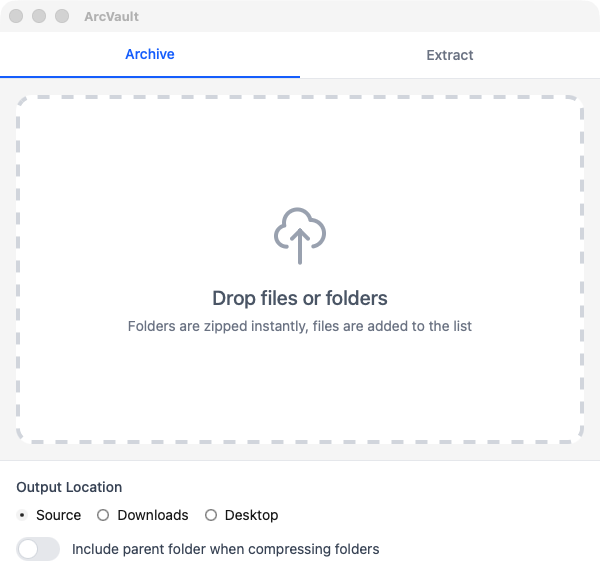
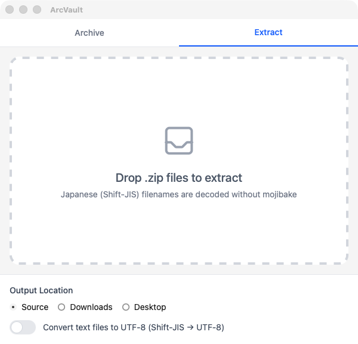

# ArcVault


A macOS desktop application for creating Windows-compatible ZIP files.

## Screenshots

| Archive | Extract |
| --- | --- |
|  |  |

## Features

- **Windows Compatible**: Sets UTF-8 Language Encoding Flag (bit 11) to prevent garbled filenames on Windows
- **Drag & Drop**: Simply drop folders or files to create ZIP archives
- **Instant Folder Compression**: Single folder drops are immediately compressed
- **Multiple Files Support**: Combine multiple files/folders into one ZIP
- **Flexible Output Location**: Choose from source location, Downloads, Desktop, or custom path
- **macOS Junk Exclusion**: Automatically excludes `.DS_Store`, `__MACOSX`, and `._` prefixed files
- **Extraction**: Drop a `.zip` to extract it, with Shift-JIS (CP932) filenames decoded without mojibake
- **Password Protected Archives**: Prompts for a password when the archive is encrypted
- **Optional Text Conversion**: Converts Shift-JIS text files to UTF-8 during extraction

## Download

Prebuilt binaries are available on the [latest GitHub Release](https://github.com/ytyng/arcvault/releases/latest):

- **macOS**: `arcvault_x.x.x_universal.dmg` (Intel / Apple Silicon universal)
- **Windows**: `arcvault_x.x.x_x64-setup.exe` (NSIS installer)

> **Note (macOS)**: The app is signed with a Developer ID certificate and
> notarized by Apple, so it launches without a Gatekeeper warning.
>
> **Note (Windows)**: The installer is unsigned, so SmartScreen may warn you.
> Click "More info" → "Run anyway".

## Tech Stack

- **Frontend**: SvelteKit 5 + Tailwind CSS 4
- **Backend**: Tauri 2 (Rust)
- **ZIP Compression**: Rust zip crate (Deflate compression)

## Development Setup

### Requirements

- Node.js 20+
- pnpm
- Rust (rustup)
- Xcode Command Line Tools

### Installation

```bash
pnpm install
```

### Development Server

```bash
pnpm tauri dev
```

### Build

```bash
pnpm build
pnpm tauri build
```

### Release

Releases are built by GitHub Actions (`.github/workflows/release.yml`) and
uploaded to GitHub Releases. The workflow is triggered manually, not on push.
`pnpm release` bumps the version, commits and pushes it, then triggers the build:

```bash
# Bumps the patch version by default; pass minor / major to bump those.
# Requires an authenticated gh CLI and a clean tree on main.
pnpm release           # 0.1.0 -> 0.1.1
pnpm release minor     # 0.1.0 -> 0.2.0
pnpm release major     # 0.1.0 -> 1.0.0
```

This builds a macOS universal dmg (Developer ID signed and notarized) and an
unsigned Windows NSIS installer, then publishes them to the `v<version>` Release.
The version is auto-incremented every release, so no manual edit of
`tauri.conf.json` is needed.

macOS signing requires these repository secrets (set once via `gh secret set`):
`APPLE_CERTIFICATE` (base64 of the Developer ID `.p12`), `APPLE_CERTIFICATE_PASSWORD`,
`APPLE_SIGNING_IDENTITY`, `APPLE_ID`, `APPLE_PASSWORD` (an app-specific password),
and `APPLE_TEAM_ID`.

## Usage

1. Launch the app
2. Drag & drop folders or files onto the window
3. Folders are immediately compressed to ZIP
4. Files are added to a list; click "Create Zip" to compress

### Settings

- **Output Location**: Source location / Downloads / Desktop / Custom
- **Include parent folder**: When ON, preserves folder structure inside ZIP

## License

MIT
